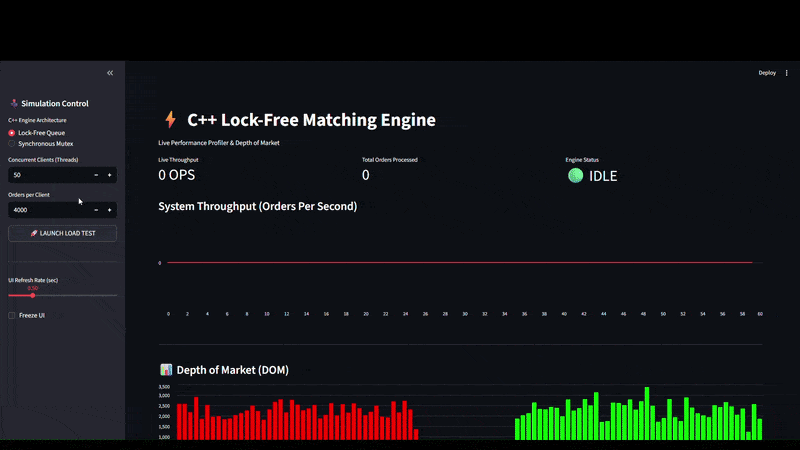

# ⚡ Concurrent Limit Order Book & Real-Time Profiler

A high-performance, multithreaded Limit Order Book (LOB) matching engine written in C++20, complete with a real-time Python/Streamlit telemetry dashboard. 

This project serves as an experimental testbed to benchmark the latency and throughput differences between standard Mutex-locked architectures and Lock-Free Single-Producer Single-Consumer (SPSC) queues under heavy concurrent network load.

 

## 🚀 Key Features
* **Binary Network Protocol:** Uses `boost::asio` for asynchronous TCP socket acceptance and reads packed binary `struct` messages to minimize serialization overhead.
* **Dual Architecture Engine:** Hot-swappable matching engine modes:
  * *Synchronous Mutex:* Network threads directly compete for a global `std::mutex` to process orders.
  * *Lock-Free Queue:* Network threads push to a `boost::lockfree::queue` (SPSC), allowing a dedicated Engine Thread to match orders sequentially without blocking network ingestion.
* **Time-Price Priority:** Implements standard matching logic using standard C++ containers.
* **Out-of-Band Telemetry:** A dedicated C++ metrics thread safely captures `std::atomic` counters and writes non-blocking JSON snapshots to feed the dashboard.
* **Live Python Dashboard:** A Streamlit web interface that visualizes Depth of Market (DOM) histograms, live Throughput (OPS), and allows users to trigger concurrent load tests directly from the browser.

## 🛠️ Technology Stack
* **Backend:** C++20, Boost (Asio, Lockfree), CMake/Make
* **Frontend/Profiling:** Python 3.12, Streamlit, Pandas
* **OS:** Linux / WSL (Ubuntu)

## 📈 Engineering Insights & Bottlenecks
During profiling, the system peaked at **~35,000 Orders Per Second (OPS)**. 
While the Lock-Free queue successfully eliminated application-level thread contention, profiling revealed that the ultimate bottleneck was the **Operating System Heap Mutex**. Because the standard C++ library containers (`std::map`, `std::list`, `std::make_shared`) dynamically allocate memory on the hot path, the threads eventually contended for the OS allocator lock. Future iterations would replace STL containers with pre-allocated memory pools and flat arrays to achieve true zero-allocation processing.

## ⚙️ How to Run Locally

### 1. Prerequisites
Ensure you have `g++` (with C++20 support), `boost`, and `python3-venv` installed.
```bash
sudo apt-get install libboost-all-dev python3-venv
```

### 2. Compile the C++ Engine
Open your terminal in the project folder and run the build command:
```bash
g++ -std=c++20 -Wall -Wextra -pthread *.cpp -o engine
./engine
```

### 3. Launch the Dashboard
Open a second terminal window (leave the engine running in the first one), activate your Python environment, and start the UI:
```bash
source venv/bin/activate
streamlit run dashboard.py
```

### 4. Run the Simulation
1. Navigate to the `http://localhost:8501` link provided by Streamlit in your browser.
2. Use the sidebar controller to select your C++ architecture (Lock-Free Queue vs. Synchronous Mutex).
3. Adjust the concurrent thread count and order volume.
4. Click **🚀 LAUNCH LOAD TEST** to blast the C++ engine with orders and watch the Throughput and Depth of Market (DOM) charts update in real-time.
